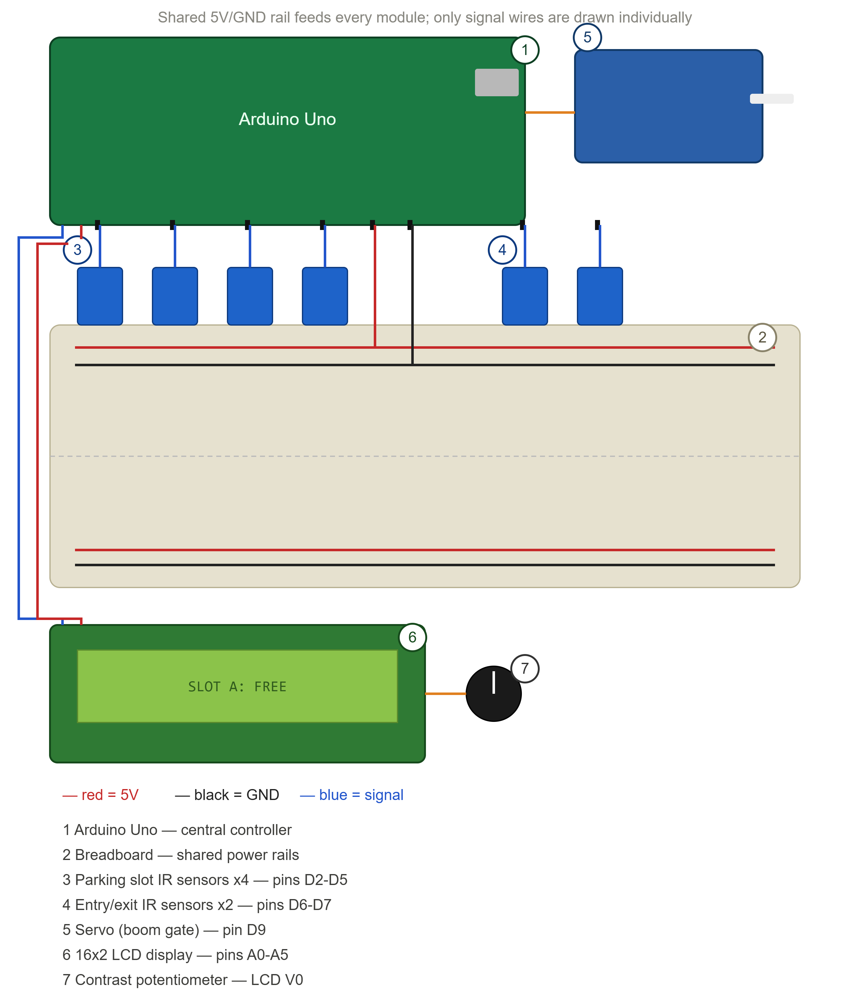

# 🅿️ Smart Parking System

A full-stack smart parking management platform paired with a working IoT hardware prototype — built to show how real-time slot detection, automated billing, and admin analytics can modernize parking in dense urban campuses like JNTU Hyderabad.

    

> 🏆 Built during a hackathon at **JNTU Hyderabad**.

---

## 📌 The problem

Most parking lots on college campuses, malls, and office parks are still managed the way they were decades ago:

- Drivers circle blindly looking for an open spot because there's no way to see slot availability before driving in.
- Attendants track occupancy and billing on paper or a whiteboard, which doesn't scale and is easy to get wrong.
- There's no record of who parked where, for how long, or how much revenue a lot actually generates.
- Entry and exit gates are either unmanned (no security) or need a person stationed there at all times.

We wanted to fix this without requiring an expensive hardware retrofit — so we built two things that work together: a **production-style software platform** that any parking operator could run today, and a **working hardware prototype** that proves the same logic maps cleanly onto real IR sensors, a boom gate, and a display.

## 💡 Our solution

**1. Software simulation (the primary deliverable)**
A complete React + Express + SQLite application that simulates a 60-slot, 3-floor parking lot end to end — no hardware required to run it. Customers register, view live slot availability, park or reserve a spot, and check out to get a digital receipt. Admins get a full dashboard with revenue analytics, parking logs, CSV export, and manual slot overrides.

**2. Hardware prototype (the hackathon demo)**
An Arduino Uno–based physical model of the same lot, scaled down to 4 slots. IR sensors detect whether a car is present in each slot and at the entry/exit gate, a servo motor raises and lowers a boom barrier, and a 16x2 LCD shows live slot status — demonstrating that the exact same occupancy logic used in the software can be driven by real sensors instead of simulated data.

Together, the two halves show the whole pipeline: **sense → decide → display/bill**, whether "sense" comes from a mocked API call or an actual infrared beam being broken by a toy car.

---

## 🔩 Hardware prototype

The physical prototype was built for the hackathon demo table using off-the-shelf components on a scaled-down 4-slot mock road layout.

### Components used

| Component | Qty | Purpose |
|---|---|---|
| Arduino Uno | 1 | Reads all sensors, drives the servo and LCD |
| IR obstacle sensor module | 4 | Detects whether each parking slot is occupied |
| IR obstacle sensor module | 2 | Detects vehicles at the entry and exit points |
| SG90 micro servo motor | 1 | Raises/lowers the boom barrier gate |
| 16x2 character LCD | 1 | Displays live slot status |
| 10kΩ potentiometer | 1 | Controls LCD contrast |
| Breadboard / perfboard + jumper wires | — | Wiring |

### Wiring diagram



**Reference pin mapping** (verify against your own sketch — pins below reflect the reference wiring used for this diagram):

| Signal | Arduino pin |
|---|---|
| Slot sensors (A–D) | D2, D3, D4, D5 |
| Entry / exit sensors | D6, D7 |
| Servo (boom gate) | D9 (PWM) |
| LCD (RS, EN, D4–D7) | A0, A1, A2, A3, A4, A5 |
| LCD contrast pot wiper | LCD V0 pin |
| Power | Shared 5V and GND bus from the Arduino to every module |

**How it works**: each slot sensor continuously reports beam-broken / beam-clear. When a vehicle crosses the entry sensor, the Arduino sweeps the servo to raise the barrier and logs the event; the exit sensor does the reverse. The LCD cycles through free/occupied counts so anyone standing at the lot can see availability without walking down every row — mirroring exactly what the web dashboard shows for the simulated lot.

---

## ✨ Features

### Customer

- **Login / Register** — create a customer account or sign in.
- **Dashboard** — live available/occupied/total slot counts, active session card with a running duration timer, quick links to parking and history.
- **Parking view** — floor switcher (A/B/C), color-coded slot grid (green = available, red = occupied, amber = reserved), slot type icons (Regular, EV, Handicap, VIP). Click a green slot to park or reserve (15-minute hold); click your own slot to check out and get a digital receipt.
- **Parking history** — every past session with entry/exit time, duration, and charge; printable receipts.
- **Dark / light mode** toggle.

### Admin

- **Dashboard** — 8 stat cards (total/occupied/available slots, revenue today, total revenue, active vehicles, reserved, long-parked 12h+), a daily/weekly revenue chart, and a recent activity table.
- **Parking logs** — full record table with search, date/vehicle/slot filters, pagination, and CSV export.
- **Slot management** — visual grid per floor with manual override (mark any slot available/occupied) and warnings for vehicles parked over 12 hours.

---

## 🛠️ Tech stack

| Layer | Technology |
|---|---|
| Frontend | React 18, Tailwind CSS 3, Framer Motion, Vite |
| Backend | Node.js, Express.js |
| Database | SQLite (via better-sqlite3) |
| Auth | JWT (jsonwebtoken + bcryptjs) |
| Charts | Recharts |
| Icons | Lucide React |
| HTTP | Axios |
| Routing | React Router v6 |
| Dates | date-fns |
| Hardware | Arduino Uno, IR obstacle sensors, SG90 servo, 16x2 LCD |

---

## 📋 Prerequisites

- **Node.js** v18+ ([nodejs.org](https://nodejs.org)) — check with `node -v`
- **npm** (comes with Node.js) — check with `npm -v`
- A terminal (Command Prompt / PowerShell on Windows, Terminal on macOS/Linux)

---

## 🪟 Windows setup (step-by-step)

1. **Install Node.js** — download the Windows Installer (.msi) from https://nodejs.org (LTS recommended), run it, click Next through the steps, check "Automatically install tools" if prompted, then **restart your PC**.
2. **Verify install** — open Command Prompt or PowerShell and run:
   ```cmd
   node -v
   npm -v
   ```
   Both should print version numbers.
3. **Extract the project** — right-click `smart_parking.zip` → Extract All → choose a location.
4. **Install dependencies**:
   ```cmd
   cd C:\Users\YourName\Desktop\smart_parking\backend
   npm install

   cd ..\frontend
   npm install
   ```
5. **Start the backend** (Terminal 1):
   ```cmd
   cd C:\Users\YourName\Desktop\smart_parking\backend
   npm run dev
   ```
   You should see `🚗 Smart Parking Backend running on http://localhost:5000`. Keep this window open.
6. **Start the frontend** (Terminal 2):
   ```cmd
   cd C:\Users\YourName\Desktop\smart_parking\frontend
   npm run dev
   ```
   You should see `Local: http://localhost:5173/`.
7. **Open the app** at **http://localhost:5173**.

Press `Ctrl+C` in each window to stop the servers.

---

## 🚀 Quick start — macOS / Linux

```bash
# 1. Install all dependencies (backend + frontend)
cd backend && npm install && cd ../frontend && npm install && cd ..

# 2. Start backend (keep this terminal open)
cd backend && npm run dev
```

In a **second terminal**:

```bash
# 3. Start frontend
cd frontend && npm run dev
```

Open **http://localhost:5173**.

> 💡 To run both servers with one command, install `concurrently` globally (`npm i -g concurrently`) and from the project root run:
> `concurrently "cd backend && npm run dev" "cd frontend && npm run dev"`

On first run, the backend automatically creates `backend/db/parking.db`, seeds **60 parking slots** across 3 floors (A, B, C — 20 each), pre-occupies **15 slots** with active sessions, creates **5 recent completed sessions**, and creates a default admin and customer account.

---

## 🔐 Default login credentials

| Role | Email | Password |
|---|---|---|
| Admin | admin@parking.com | admin123 |
| Customer | customer@parking.com | customer123 |

---

## ⚙️ System details

### Parking slots (auto-seeded)

| Floor | Regular (70%) | EV (15%) | Handicap (10%) | VIP (5%) | Total |
|---|---|---|---|---|---|
| A | 14 | 3 | 2 | 1 | 20 |
| B | 14 | 3 | 2 | 1 | 20 |
| C | 14 | 3 | 2 | 1 | 20 |
| **Total** | **42** | **9** | **6** | **3** | **60** |

### Pricing

| Period | Rate | Details |
|---|---|---|
| Normal | ₹30/hour | First hour flat, then ₹0.50/min |
| Peak hours | ₹50/hour | 9–11 AM & 5–8 PM (IST) |
| Minimum | ₹20 | Regardless of duration |

### Reservation timer

- Reserved slots auto-release after **15 minutes** if the user doesn't check in.
- The backend checks and clears expired reservations every 60 seconds.

### Long-parking warnings

- Vehicles parked over **12 hours** are flagged with a warning icon; the admin dashboard shows a count of long-parked vehicles.

---

## 📁 Project structure

```
smart-parking/
├── backend/
│   ├── server.js              # Express server entry point
│   ├── package.json
│   ├── db/
│   │   └── database.js        # SQLite setup, seeding, cleanup
│   ├── middleware/
│   │   └── auth.js            # JWT authentication middleware
│   ├── routes/
│   │   ├── auth.js            # Auth routes (login, register, me)
│   │   ├── slots.js           # Slot routes (list, reserve, park, checkin)
│   │   ├── parking.js         # Parking routes (exit, history, receipt)
│   │   └── admin.js           # Admin routes (stats, logs, revenue, export)
│   └── controllers/
│       ├── authController.js
│       ├── slotController.js
│       ├── parkingController.js
│       └── adminController.js
├── frontend/
│   ├── index.html
│   ├── package.json
│   ├── vite.config.js
│   ├── tailwind.config.js
│   ├── postcss.config.js
│   └── src/
│       ├── main.jsx
│       ├── App.jsx
│       ├── index.css           # Tailwind + custom glassmorphism styles
│       ├── api/
│       │   └── axios.js        # Axios instance with auth interceptor
│       ├── context/
│       │   ├── AuthContext.jsx  # Auth state management
│       │   └── ThemeContext.jsx # Dark/Light theme toggle
│       ├── components/
│       │   ├── Sidebar.jsx
│       │   ├── SlotCard.jsx
│       │   ├── BookingModal.jsx
│       │   ├── CheckoutModal.jsx
│       │   ├── ReceiptModal.jsx
│       │   ├── StatsCard.jsx
│       │   ├── FloorSwitcher.jsx
│       │   └── ProtectedRoute.jsx
│       └── pages/
│           ├── Login.jsx
│           ├── Register.jsx
│           ├── CustomerDashboard.jsx
│           ├── ParkingView.jsx
│           ├── MyHistory.jsx
│           ├── AdminDashboard.jsx
│           ├── AdminParkingLog.jsx
│           └── AdminSlotManagement.jsx
└── docs/
    └── circuit-diagram.png     # Hardware prototype wiring diagram
```

---

## 📡 API endpoints

### Auth
- `POST /api/auth/register` — register new customer
- `POST /api/auth/login` — login (returns JWT)
- `GET /api/auth/me` — get current user (requires auth)

### Slots
- `GET /api/slots?floor=A` — list slots (optional floor filter)
- `GET /api/slots/:id` — get single slot
- `POST /api/slots/:id/park` — park immediately
- `POST /api/slots/:id/reserve` — reserve for 15 min
- `POST /api/slots/:id/checkin` — check in after reservation

### Parking
- `POST /api/parking/:id/exit` — exit and calculate fare
- `GET /api/parking/my-history` — customer's parking history
- `GET /api/parking/active-session` — current active session
- `GET /api/parking/receipt/:id` — get receipt for a completed session

### Admin (requires admin role)
- `GET /api/admin/stats` — dashboard statistics
- `GET /api/admin/logs` — parking logs with filters
- `GET /api/admin/revenue?period=daily` — revenue analytics
- `PATCH /api/admin/slots/:id` — override slot status
- `GET /api/admin/export` — export records as CSV

---

## 🎨 UI design

- Dark theme with deep navy/purple gradients and glassmorphism
- Vibrant accents: cyan, emerald, violet
- Smooth animations via Framer Motion — page transitions, slot card animations, animated counters
- Slot cards pulse when occupied, glow on hover when available
- Fully responsive, with a one-click dark/light mode toggle

---

## 🔭 Future scope

- Replace the mocked IoT layer with a real MQTT/HTTP bridge so the Arduino prototype writes directly into the live backend instead of the seeded database.
- Add UPI/card payment integration for checkout instead of a simulated receipt.
- Support multiple physical lots per admin account.
- Add number-plate recognition (ANPR) at the entry/exit sensors instead of simple IR presence detection.

---
